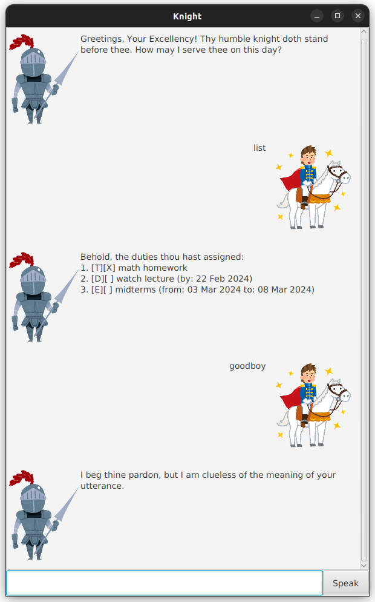

# Knight Guide

Hail, Your Excellency!

I, thy loyal Knight, doth present myself as thy personal aide in the noble quest of task management.

I am a **command line application**, 
crafted to assist thee in the meticulous tracking of thy tasks, deadlines, and noble events.
Fear not, for I am fashioned to be as simple as the swing of a sword, intuitive in nature.

--------------------------------------------------------------------------------------------------------------------

## Quick start

1. Ensure thou have Java `11` or above installed in your Computer.

2. Download the latest `Knight.jar` from [here](https://github.com/narwhalsilent/ip/releases).

3. Copy the file to the folder you want to use as the _home folder_ for thy Knight.

4. Open a command terminal, `cd` into the folder you put the jar file in, and use the `java -jar Knight.jar` command to run the application.<br>
   A GUI similar to the below should appear in a few seconds. <br>
   

5. Type the command in the command box and press Enter to execute it. e.g. typing **`help`** and pressing Enter will open the help window.<br>
   Some example commands you can try:
   - Add a task using the `todo`, `deadline`, or `event` command.
     - Todo tasks are simple tasks with only a name.
     - Deadline tasks have a due date specified with `/by`,
     - Event tasks have a start and end date specified with `/from` and `/to`.
   - When referring to a task using `mark`, `unmark` and `delete`, use the task number as shown in the list.
     - For example, `mark 1` marks the first task as done.
   - The command `find` searches for tasks with descriptions containing the given keyword.
   - Update a task as if thou art adding a new task, but with the prefix changed to `update [index]`.
     - For example, `update 1 [description] /by [date]` updates the first task, which must be a deadline.
     - Note that thou canst not update the species of a task.
   - Save the tasks to file using the `save` command.
     - The file is saved in the same directory as the Knight application with the name `scroll_of_tasks.txt`.

6. Refer to the Features below for details of each command.

--------------------------------------------------------------------------------------------------------------------

## Features

### ToDo
Adds a ToDo task to the list of tasks.

Format: `todo [description]`<br>
Example: `todo assignment`

### Deadline
Adds a Deadline task to the list of tasks. It requires a due date.

Format: `deadline [description] /by [date]`<br>
Example: `deadline homework /by 2024-02-24`

### Event
Adds an Event task to the list of tasks. It requires a start and end date.

Format: `event [description] /from [start_date] /to [end_date]`<br>
Example: `event party /from 2024-02-24 /to 2024-02-25`

### Delete
Deletes a task from the list of tasks.

Format: `delete [index]`<br>
Example: `delete 3`

### Mark
Marks a task as done.

Format: `mark [index]`<br>
Example: `mark 1`

### Unmark
Marks a task as not done.

Format: `unmark [index]`<br>
Example: `unmark 1`

### Update
Updates a task in the list of tasks.
- Note that thou canst not change the species of a task.
- Use the command as if thou art adding a new task, but with the prefix changed to `update [index]`.
- Thou must specify the information of the task in full, even if thou art only updating one field.

Format: `update [index] [information]`<br>
Example: `update 1 homework /by 2024-02-24`

### Find
Finds tasks whose descriptions contain the given keyword.

Format: `find [keyword]`<br>
Example: `find homework`

### List
Lists all tasks in the list of tasks.

Format: `list`

### Save
Saves the tasks to the file `scroll_of_tasks.txt` in the same directory as the Knight application.

Format: `save`

### Bye
Exits the application.

Format: `bye`

When thou art unsure of the use of a command,
simply type the command without any arguments to see a brief description of its usage.
--------------------------------------------------------------------------------------------------------------------

## FAQ

**Q**: How do I transfer my data to another computer?<br>
**A**: Copy the `scroll_of_tasks.txt` file to the same directory as the Knight application on the other computer.
It will automatically load the tasks from the file when the application is started.

## Command summary
| Action       | Format, Examples                                                                                                |
|--------------|-----------------------------------------------------------------------------------------------------------------|
| **ToDo**     | `todo [description]` e.g., `todo assignment`                                                                    |
| **Deadline** | `deadline [description] /by [date]` e.g., `deadline homework /by 2024-02-24`                                    |
| **Event**    | `event [description] /from [start_date] /to [end_date]` <br>e.g., `event party /from 2024-02-24 /to 2024-02-25` |
| **Delete**   | `delete [index]` e.g., `delete 3`                                                                               |
| **Mark**     | `mark [index]` e.g., `mark 1`                                                                                   |
| **Unmark**   | `unmark [index]` e.g., `unmark 1`                                                                               |
| **Update**   | `update [index] [information]` e.g., `update 1 homework /by 2024-02-24`                                         |
| **Find**     | `find [keyword]` e.g., `find homework`                                                                          |
| **List**     | `list`                                                                                                          |
| **Save**     | `save`                                                                                                          |
| **Bye**      | `bye`                                                                                                           |

--------------------------------------------------------------------------------------------------------------------

At thy service, Your Excellency, is thy
   ```
┓┏┓  •  ┓  
┃┫ ┏┓┓┏┓┣┓╋
┛┗┛┛┗┗┗┫┛┗┗
       ┛
   ```
